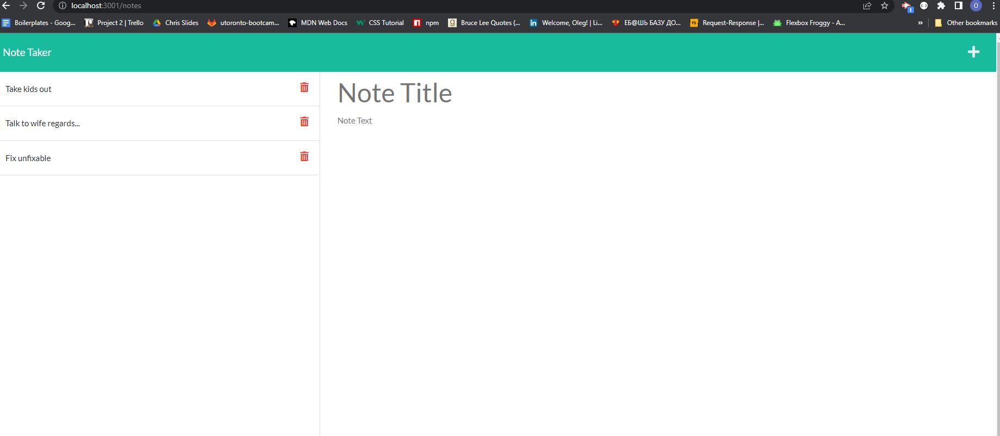
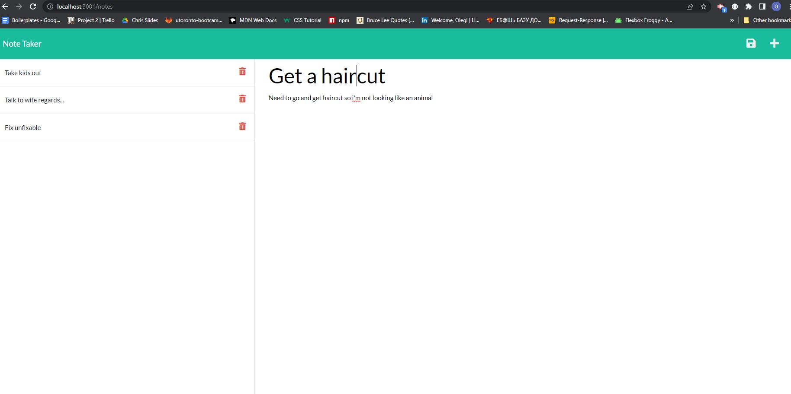

<h># Note taker</h>
# Student Id.
# Oleg Dobrovolskyi

# Repository Link
https://github.com/MrBearSir/NoteTaker

# Live Link
https://note-taker-oleg.herokuapp.com/

# Project type.
Express.js

# User Story.
AS A small business owner
I want to be able to write and save notes
So that I can organize my thoughts and keep track of tasks I need to complete

# Skills used in development.
<ul>
<li>Use of Express module.</li>
<li>Using JSON file to store data.</li>
<li>Deploying on Heroku.</li>
<li>CRUD routing.</li>
</ul>